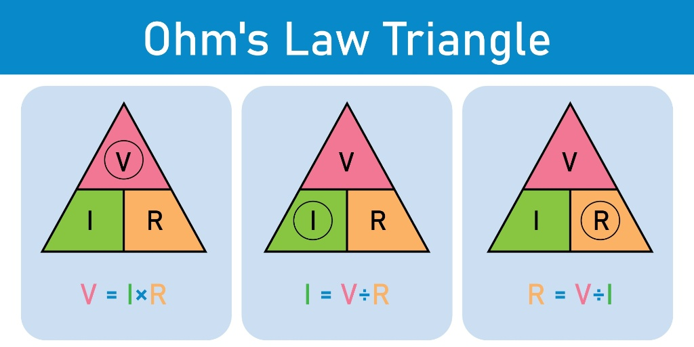

  <h1>⚡ Series Circuit Simulator</h1>
  
<strong>An interactive web-based educational tool for simulating electrical series circuits and performing Ohm's Law calculations.</strong>

  

    
    
  

<h2>📝 Project Overview</h2>

This project is a high-fidelity <strong>Series Circuit Simulator</strong> designed to bridge the gap between theoretical physics and practical application. It allows users to visualize how current flows through a single path and provides a real-time calculator for core electrical parameters.

<h2>🚀 Technical Features</h2>
<ul>
  <li><strong>Dynamic Circuit Logic:</strong> Real-time calculation of resistance, current, and voltage using pure JavaScript.</li>
  <li><strong>Interactive Simulation:</strong> Visual state management to toggle light bulb states (ON/OFF).</li>
  <li><strong>Positioned UI Overlays:</strong> Precise CSS absolute positioning to overlay input fields directly onto circuit diagrams.</li>
  <li><strong>Error Handling:</strong> Logic included to prevent division-by-zero errors in calculations.</li>
</ul>

<h2>🛠️ Tech Stack</h2>
<ul>
  <li><strong>Frontend:</strong> HTML5, CSS3 (Flexbox, Absolute Positioning)</li>
  <li><strong>Logic:</strong> JavaScript (ES6+)</li>
  <li><strong>Deployment:</strong> GitHub Pages</li>
</ul>

<h2>📂 Project Architecture</h2>
<pre>
series-circuit-simulator/
├── index.html          # Semantic Structure & UI Sections
├── styles/
│   └── series.css      # Custom UI Styling & Diagram Overlays
├── scripts/
│   └── series.js       # Physics Engine & Calculation Logic
└── images/             # Optimized Visual Assets
</pre>

<h2>⚙️ Physics Formulas Integrated</h2>

The simulator performs calculations based on standard electrical engineering principles:

  

<ul>
  <li><strong>Total Resistance ($R_t$):</strong>   $$R_t = R_1 + R_2 + R_3$$</li>
  <li><strong>Ohm's Law (Current):</strong>   $$I = \frac{V}{R_{total}}$$</li>
  <li><strong>Voltage Divider Rule:</strong>   $$V_n = \frac{V_{total}}{n}$$   <em>(Implemented for equal distribution across components)</em></li>
</ul>

  <h2>👤 Author</h2>
  
<strong>M Husnain</strong>

  

    
  

   
  
<i>Developed for educational excellence and to demonstrate modern frontend engineering capabilities.</i>

